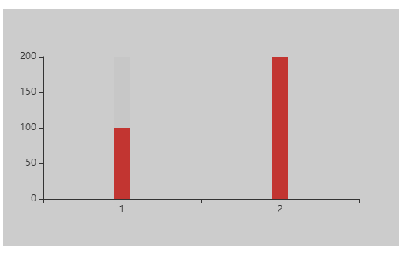

# lm-custom
> A Vue.js project

## Build Setup



基于百度Echarts做简单的封装，可简单的实现柱状图和线框图转换实现。
不破坏Echarts内部封装方法以及使用。
后续持续更新中......

``` bash
# install dependencies
1.npm install lm-echarts

2.main.js
import lmEcharts from 'lm-echarts'
Vue.use(lmEcharts);

3.在页面直接<lm-echarts></lm-echarts>使用

（1）参数 cfCustom type:Object
     id:String (必选)
     backgroundColor:String
     w:String
     h:String
     title:String,
     xData:Object
           data:[]
     yData:Object
     serveData:Object
          name:String,
          showBackground: Boolean,
           barWidth:String ***在type设置为'bar'时设置***
          type:String,
          data:Array
  (3)事件  @onChangeData 参数（el）
     在未破坏Echarts源码的情况下使用el.setOption({})


What today will be like is up to me , I get to choose what kind of day I will have.
# lm-custom
# lm-custom
# lm-custom
